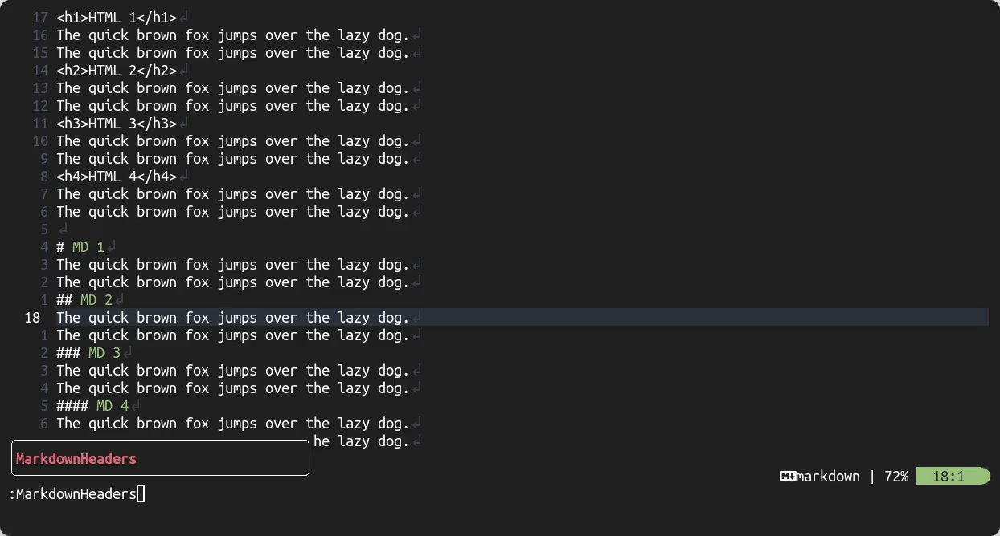

# Markdown Headers

Markdown Headers is a simple/basic Neovim plugin that allows you to easily navigate between headings in a Markdown file.



## Why use Markdown Headers?

-   It saves time and effort when navigating long and complex markdown documents.
-   It works for both Markdown and HTML headings.
-   It helps you keep track of your location in the document.
-   It can improve your productivity and efficiency when writing or editing markdown documents.

There are probably plenty of other plugins that do the exact same thing and are probably nicer to look at 😅, feel free to use them.
I only made this plugin to learn a bit more about the Neovim API and for **FUN** 😉.

## Installation

### Using [Packer](https://github.com/wbthomason/packer.nvim)

1. Add this to your Neovim config:

```lua
use {
    'AntonVanAssche/md-headers.nvim',
    requires = {
        'nvim-lua/plenary.nvim'
    }
}

```

2. Run `:PackerSync` to install the plugin on your machine.

### Using [Vim-Plug](https://github.com/junegunn/vim-plug)

1. Add the following to your Neovim config:

```vim
Plug 'nvim-lua/plenary.nvim'
Plug 'AntonVanAssche/md-headers.nvim'
```

2. Run `:PlugInstall` to install the plugin on your machine.

### Manually

1. Clone this repository into your Neovim ~/.config/nvim/pack/plugins/start/directory.

## Usage

To use the Markdown Headers plugin, use the ':MarkdownHeaders' command to display a list of headings in the current buffer in a floating window.
The headings will include both Markdown and HTML headings.
You can navigate to a heading by pressing Enter on it, and the cursor will move to the corresponding heading in the main window.
You can also press Escape or q to close the window.
The window will also close automatically when you've selected a heading.

To start the plugin with the cursor already positioned on the closest heading, use the ':MarkdownHeadersClosest' command instead.

Examples:

```
:MarkdownHeaders
:MarkdownHeadersClosest
```

## License

Markdown Headers is licensed under the MIT License. See the [LICENSE.md](./LICENSE.md) file for more information.

## Contributing

Contributions are welcome! Please feel free to submit a pull request or open an issue for any bugs or feature requests.
