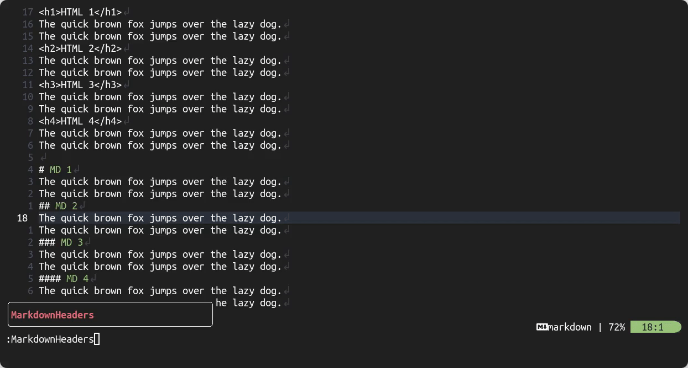

# Markdown Headers

Markdown Headers uses Neovim's Treesitter to provide fast and efficient
navigation between Markdown and HTML headings, with quick jumping, a heading
list, and full customization.



## Installation

This plugin depends on:

- [nvim-lua/plenary.nvim](https://github.com/nvim-lua/plenary.nvim)
- [nvim-treesitter/nvim-treesitter](https://github.com/nvim-treesitter/nvim-treesitter)
  - __Parsers__: `markdown`, `html`

An example using [lazy.nvim](https://github.com/folke/lazy.nvim):

```lua
return {
  'AntonVanAssche/md-headers.nvim',
  cmd = {
    'MDHeaders',
    'MDHeadersCurrent',
    'MDHeadersQuickfix',
    'MDHeadersTelescope',
  },
  dependencies = {
    'nvim-lua/plenary.nvim',
    'nvim-treesitter/nvim-treesitter',
  },
  ft = { 'markdown' },
  opts = {},
}
```

> [!IMPORTANT]
> Markdown parsing requires a Treesitter parser. Neovim does __not__ ship with a
> Markdown parser by default.
>
> Install it manually or via nvim-treesitter. When using nvim-treesitter,
> ensure it loads __before__ this plugin.

## Commands

- `:MDHeaders`: Show all headings in a popup
- `:MDHeadersCurrent`: Show headings focused on current section
- `:MDHeadersQuickfix`: Toggle quickfix list with headings
- `:MDHeadersTelescope`: Open Telescope picker (requires
  [telescope.nvim](https://github.com/nvim-telescope/telescope.nvim))

## Telescope Integration

Markdown Headers provides a Telescope extension to navigate headings in the
current buffer, giving you a preview of each section so you can quickly
understand where you are in large files.

As any other Telescope extension, you can call it with the following command:

```vim
:Telescope md-headers headings
```

However, the plugin provides an alias for this command:

```vim
:MDHeadersTelescope
```

## Configuration

Default config:

```lua
{
  width = 60,
  height = 10,
  borderchars = { "─", "│", "─", "│", "╭", "╮", "╯", "╰" },
  headerchars = { "󰲡 ", "󰲣 ", "󰲥 ", "󰲧 ", "󰲩 ", "󰲫 " },
  indent = 2,
  popup_auto_close = true,
  win_options = {
    number = false,
    relativenumber = false,
    cursorline = true,
    scrolloff = 0,
  },
  highlight_groups = {
    title = nil,
    border = nil,
    text = nil,
    headers = { nil, nil, nil, nil, nil, nil },
  },
}
```

## Recommended Keymaps

```lua
local map = vim.keymap.set

map("n", "<leader>mh", "<cmd>MDHeaders<cr>")
map("n", "<leader>mc", "<cmd>MDHeadersCurrent<cr>")
map("n", "<leader>mq", "<cmd>MDHeadersQuickfix<cr>")
map("n", "<leader>mt", "<cmd>MDHeadersTelescope<cr>")
```

## Contributing

- Fork, improve, and submit a PR.
- Open an issue for suggestions.

See [`CONTRIBUTING.md`](./CONTRIBUTING.md) for more information.

## License

Markdown Headers is licensed under the MIT License. See the
[LICENSE.md](./LICENSE.md) file for more information.
